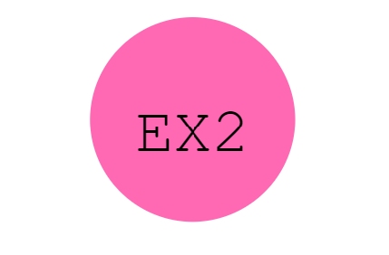

# SVG-Logo-Maker

## Description

A Node.js command-line application that takes in user input to generate a logo and save it as an SVG file. The application prompts the user to select a color and shape, provide text for the logo, and save the generated SVG to a .svg file.

## Table of Contents

- [Installation](#installation)
- [Usage](#usage)
- [License](#license)
- [Questions](#questions?)
- [Test](#tests)

## Installation

The necessary applications to run this program are:
Install inquirer, inquirer-maxlength-input-prompt, and is-color to run base application (use npm i "inquirer", npm i "inquirer.maxlength-input prompt" and npm i is-color in integrated terminal). Install jest (npm i jest) to run program tests. 

## Usage

Start program using the command "npm start". Inquirer will then prompt user with four questions about their logo's shape, color, text, and text color. Press enter to submit answers.

## License 

[MIT](https://choosealicense.com/licenses/mit/)

## Questions? 

If you have questions or have notived a bug in this code, please reach out:

Name: Alejandra Bernabel
Email: alejandra-e-bernabel@gmail.com
GitHub: https://github.com/alejandra-e-bernabel

## Tests 

Use command npm test to run jest tests.
